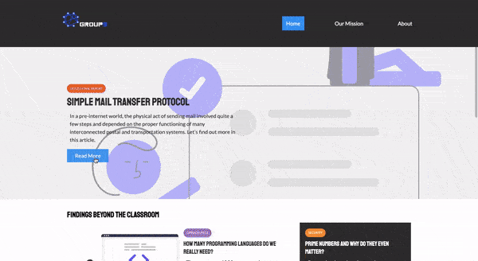

# GROUP9 Informational Website

- This started as a simple written report on Simple Mail Transfer Protocols for my Data Communications Fundamentals course that I took during the Winter of 2021.
- In the end I ended up making an informational website instead in order to explain the topic.

- In this cool group project me and my 2 other group members (Omar and Lucas) also demonstrated the SMTP protocol by utilizing python.

## Demo

## Technologies Used For This Website

- HTML
- CSS (Grid and Flex)

## Technologies Used For SMTP Demo

- Python
